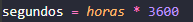
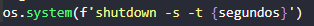
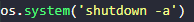
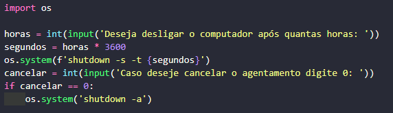
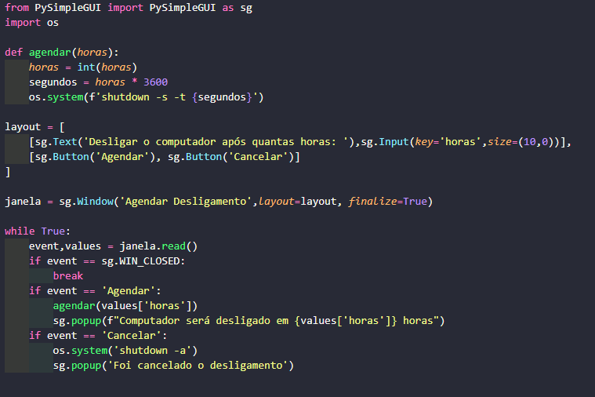

<h1> Script em python para agendar que o computador desligue após determinado tempo. </h1>

<h2> Objetivo </h2>

&nbsp;&nbsp;&nbsp;&nbsp; Criar um programa que realize o agendamento para que o computador desligue automaticamente após um determinado périodo de tempo digitado pelo usúario. 

<h2> Sobre o Projeto: </h2>

&nbsp;&nbsp;&nbsp;&nbsp; Se você é como eu que normalmente, coloca músicas no computador para dormir, ou deixa o computador realizando downloads durante a noite, então você provavelmente fará como eu e deixará o computador ligado durante a noite toda para realizar um processo que poderia levar poucas horas. Então enquanto buscava por um solução para este problema, desenvolvi este repósitorio para as pessoas que se encontrem no mesmo problema. 

    
<h2> Explicação do Código </h2>

&nbsp;&nbsp;&nbsp;&nbsp; Durante a pesquisa que fiz para descobrir como desligar o computador automaticamente, encontrei com o comando do cmd. <code> shutdown -shutdown -s -t  numero</code> onde o número representa que após <i> numero  </i>segundos a máquina irá desligar automaticamente.  Com este comando eu conseguia fazer com que minha máquina fosse desligada após um determinado período de tempo, podendo assim por exemplo colocar uma playlist de 2 horas de músicas para dormir, e utilizar o comando <code> shutdown -s -t 7200 </code> sendo que precisei converter 2 horas em segundos para colocar no comando, após passar as 2 horas o computador desligará sozinho, resolvendo meu problema de deixa-lo ligado.

&nbsp;&nbsp;&nbsp;&nbsp; Pórem percebi que fica muito massante ter de ficar convertendo horas em segundos toda as vezes que eu for fazer este processo, então enquanto estudava sobre Python me deparei com a biblioteca <b> os </b> que permite que eu execute comandos no terminal através do python, e que o mesmo problema de converter as horas em segundos poderia ser facilmente resolvido em python com um simples comando: 

    

&nbsp;&nbsp;&nbsp;&nbsp; Com um script simples eu poderia realizar o processso que faria através do cmd utilizando o seguinte código: 

    

&nbsp;&nbsp;&nbsp;&nbsp; Caso eu necessite cancelar este agendamento é só utilizar o comando <code> shutdown -a </code> que o agendamento é cancelado, ou no python: 

    

&nbsp;&nbsp;&nbsp;&nbsp; Tendo os dois comandos para realizar o processo só precisamos pedir o valor das horas ao usúario e também fazer um meio para que o usuario cancele caso queira. Para realizar isso podemos fazer de dois modos, com uma interface gráfica ou através do terminal do python mesmo, ou seja sem a interface gráfica.
 
<h3> Código sem Interface Gráfica x Código com Interface gráfica </h3>

&nbsp;&nbsp;&nbsp;&nbsp; Sem a interface gráfica o código fica muito mais simples de entender, vou mostrar a imagem dos dois códigos para que seja possivel ver a diferença entre eles. 

<h4 align='center'> Código Sem interface Gráfica </h4>

 Este é o código sem interface gráfica. 

    

 Resultando na seguinte sáida: 

    
     
     
    <h4 align='center'> Código Com interface Gráfica </h4>

 Este é o código com interface gráfica 

    

 Resultando na seguinte sáida: 

    